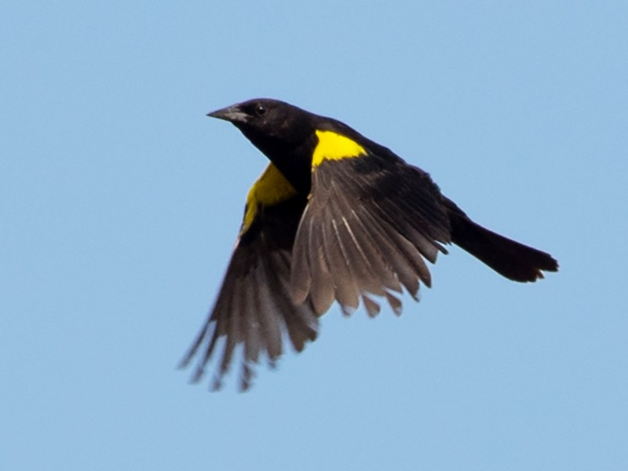

# 
In this competition, I identify a wide variety of bird vocalizations in soundscape recordings. A specific named bird species may be in the forefront, with anthropogenic sounds (such as airline overflights) or other bird and non-bird calls (such as chipmunk calls) in the background. Researchers will have a greater understanding of how pollution levels, changes in habitat quality, and the success of restoration initiatives thanks to this work. Reliable machine listeners would also enable data-driven conservation at a scale not now conceivable and would permit conservationists to deploy more recording units globally. Many living things, including humans and birds, could see a significant improvement in their quality of life as a result of the ultimate conservation efforts.

# About - `Training`

In this notebook, I try ResNeSt, which is the one of state of the art in image recognition.

The experimental settings are as follows:

* Randomly crop 5 seconds for each train audio clip each epoch.
* No augmentation -> Augmentation Implemented
* Used pretrained weight of _`ResNeSt50-fast-1s1x64d`_ provided by the authors at [their repository](https://github.com/zhanghang1989/ResNeSt).
* Used `BCELoss`
* Trained **_50_** epoch and saved the weight which got best **_loss_** (this is because f1 score relies on thresholds.)
* `Adam` optimizer (`lr=0.001`) with `CosineAnnealingLR` (`T_max=10`).
* Used `StratifiedKFold(n_splits=5)` to split dataset and used only first fold
* `batch_size`: **_50_**
* melspectrogram parameters
  - `n_mels`: 128
  - `fmin`: 20
  - `fmax`: 16000
* image size: 224x547

# about dataset
I used resmpaled train dataset for this notebook, see more details in [discussion]('https://www.kaggle.com/c/birdsong-recognition/discussion/164197').

# about custom packages
In the **training notebook**, I used two custom packages, `pytorch-pfn-extras` for training and the authors' official implementation of `ResNeSt` for building model.  

# Reference
## ResNeSt: Split-Attention Networks
* author: Hang Zhang, Chongruo Wu, Zhongyue Zhang, Yi Zhu, Zhi Zhang, Haibin Lin, Yue Sun, Tong He, Jonas Muller, R. Manmatha, Mu Li and Alex Smola 
* paper: [arXiv 2004.08955](https://arxiv.org/abs/2004.08955)
* code: [GitHub](https://github.com/koukyo1994/kaggle-birdcall-resnet-baseline-training)

## pytorch-pfn-extras
* author: Preferred Networks, Inc.
* code: [GitHub](https://github.com/pfnet/pytorch-pfn-extras)
